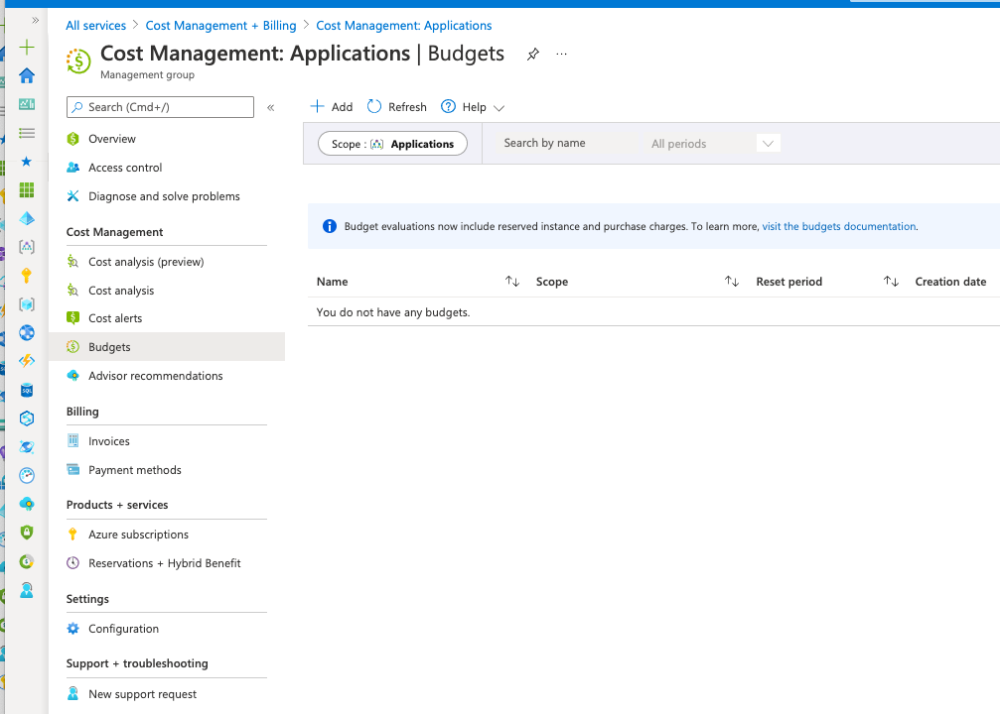
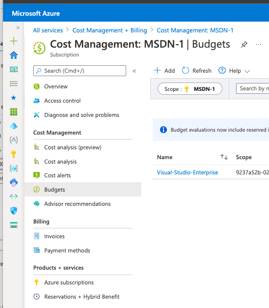
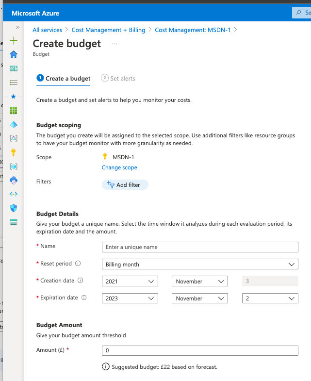
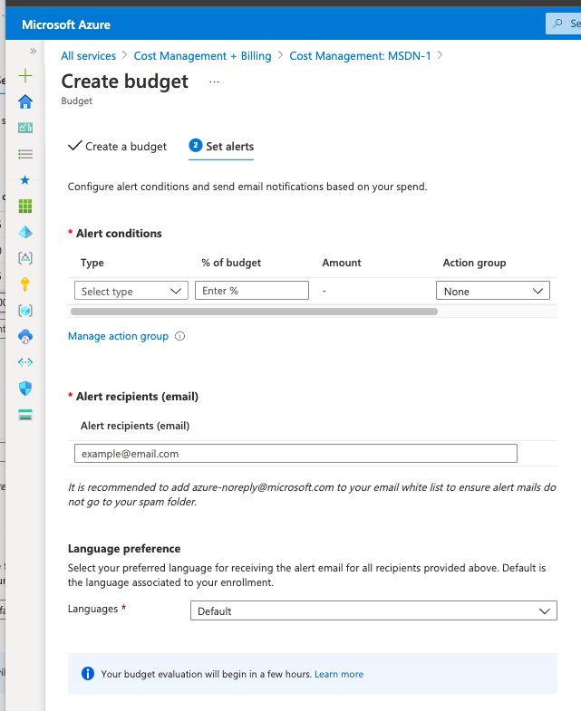
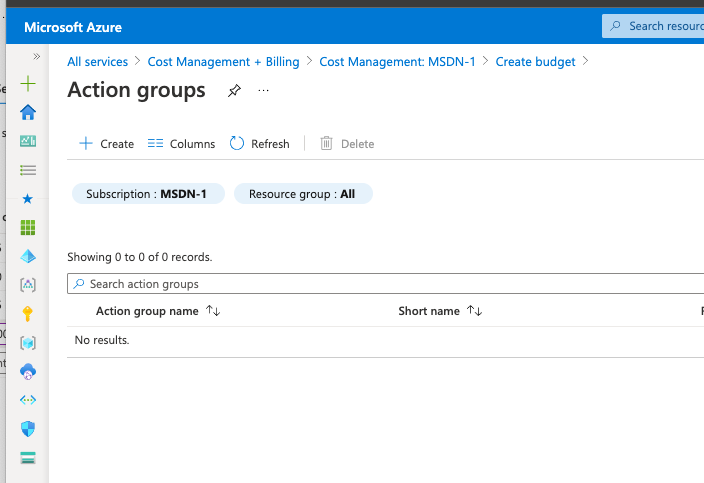
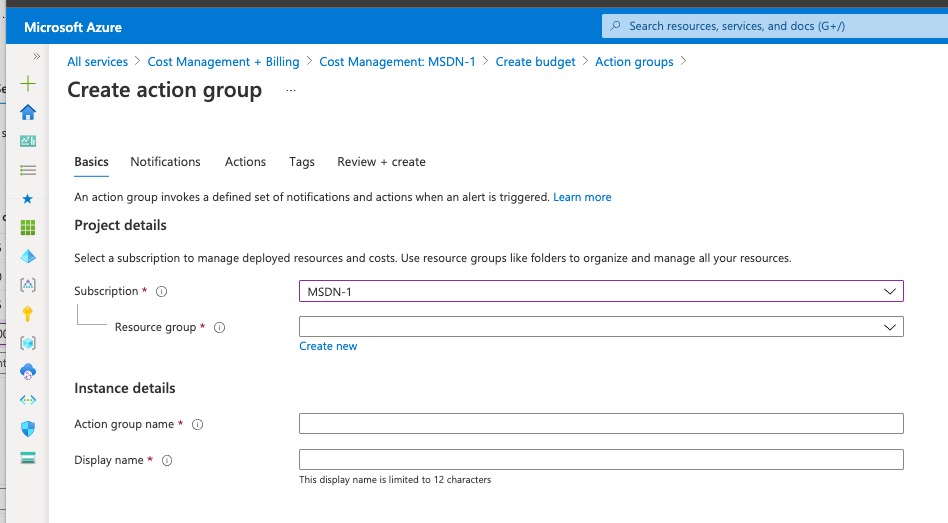
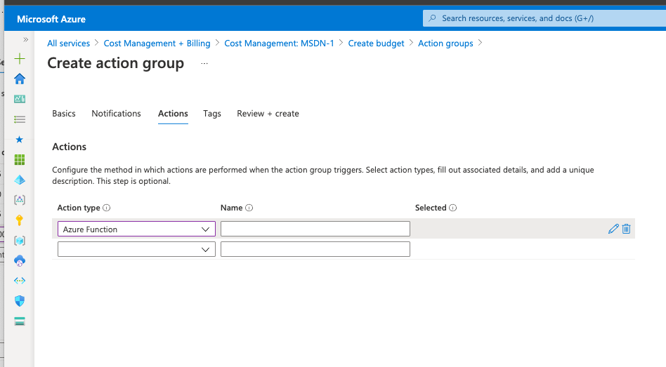
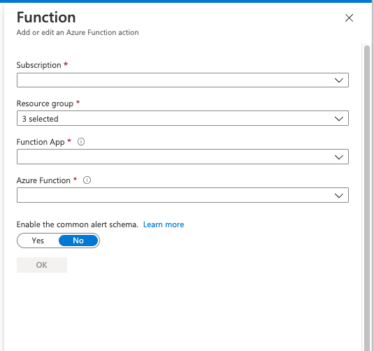

# Budgets

## Getting Started

### Deployment

Within a Subscription which is outside of the budgets, run the [Deployment](##Deployment) commands

```shell
az group create \
    --name '<Update>' \
    --location '<Update>'

az deployment group create \
    --resource-group '<Update>' \
    --template-file ./eng/infra/main.bicep \
    --parameters name='<Update>' location='<Update>'
```

```powershell
New-AzResourceGroup `
    -Name "<Update>" `
    -Location "<Update>"

New-AzResourceGroupDeployment `
    -ResourceGroupName "<Update>" `
    -TemplateFile "./eng/infra/main.bicep" `
    -TemplateParameterObject @{"name"="<Update>"; "location"="<Update>";}:
```

> There is also an ARM Template available within the infra / folder

### Permissions

1. Navigate to the Subscription blade which will be enrolled for Budget management

Screenshot-A

2. Select Access control (IAM) and Add role assignment

Screenshot-B

3. Within the Role section, select Owner

Screenshot-C

4. Within the Members, add the Managed Identity (Syste) of the Azure Function which was deployed earlier

Screenshot-D

5. Review + assign

Screenshot-E

### Budgets

1. Navigate to the Azure Portal and Open the Cost Management + Billing blade

    

2. Navigate to the Budgets section

    

3. Create a new Budget for the selected Scope (Subscriptions) and define the Period & Amount

    

4. Select Manage action group

    

5. Create new Action group

    

6. Provide Project and Instance details for the new Action group

    

7. Navigate to Actions pane and select _Azure Function_ as the Action type

    

8. Select the Subsciption, Resource Group and Function App which was deployed in Step 1.

    

    > Ensure that _Enable the common alert schema_ is set as No
